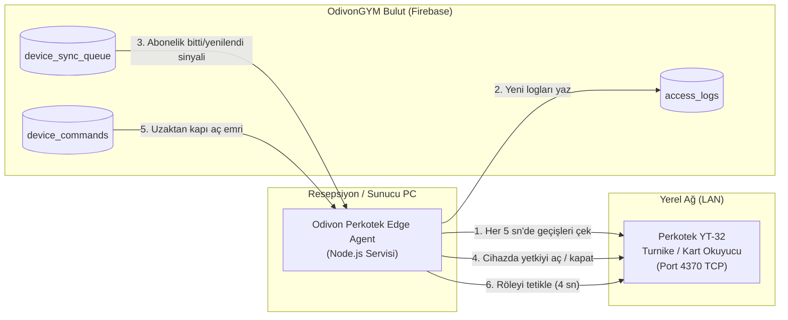

# OdivonGYM — Perkotek YT-32 Turnike Edge Agent Kurulum Kılavuzu

Bu belge, **OdivonGYM Bulut Yönetim Platformu** ile spor salonunuzdaki **Perkotek YT-32** (yüz tanıma, parmak izi ve RFID kart) turnike cihazı arasındaki entegrasyonu sağlayan **Edge Agent** (Yerel Köprü) servisinin kurulum ve işletim rehberidir.

---

## 1. Mimari ve Çalışma Mantığı

Web tarayıcıları güvenlik kısıtlamaları (sandbox) sebebiyle doğrudan yerel ağdaki bir IP adresine ham TCP soketi (Port 4370) açamaz. Bu sebeple salonun yerel ağında hafif bir köprü servisi (**Edge Agent**) çalışır.



---

## 2. Ön Gereksinimler

| Gereksinim | Açıklama |
| :--- | :--- |
| **İşletim Sistemi** | Windows 10, Windows 11 veya Linux / Raspberry Pi |
| **Çalışma Ortamı** | [Node.js](https://nodejs.org) (v18, v20 veya üzeri LTS sürümü) |
| **Ağ Bağlantısı** | Bilgisayar ve Perkotek YT-32 cihazı aynı yerel ağa (aynı modem veya switch'e) bağlı olmalıdır |
| **Cihaz Bağlantısı** | Perkotek YT-32 cihazının Ethernet kablosu takılı ve ağ ışığı yanıyor olmalıdır |

---

## 3. Adım Adım Kurulum

### Adım 1: Perkotek YT-32 Cihaz IP Ayarları
1. Perkotek cihazının klavyesinden **`M/OK`** tuşuna basılı tutun ve yönetici doğrulaması yapın.
2. Menüden **İletişim (Comm.) > Ağ (Ethernet)** sekmesine girin.
3. Cihaza salon ağınızda çakışmayan sabit bir IP atayın:
   - **IP Adresi:** `192.168.1.201` *(veya ağınıza uygun boş bir IP)*
   - **Alt Ağ Maskesi:** `255.255.255.0`
   - **Ağ Geçidi (Gateway):** `192.168.1.1` *(Modem IP'si)*
   - **Port:** `4370` *(Varsayılan)*
4. Bilgisayarınızdan komut satırını (`cmd`) açıp bağlantıyı test edin:
   ```bash
   ping 192.168.1.201
   ```
   > [!NOTE]
   > `ping` komutu başarılı cevap veriyorsa (Reply from 192.168.1.201: bytes=32...) cihaz ağda hazırdır.

---

### Adım 2: Firebase Service Account Anahtarını Alma
Edge Agent'ın bulut veritabanına güvenli erişebilmesi için Firebase'den bir özel anahtar (Private Key) gereklidir:

1. Tarayıcınızda [Firebase Console](https://console.firebase.google.com/) adresini açın ve OdivonGYM projenize girin.
2. Sol üst kısımdaki **Proje Ayarları (Project Settings ⚙️)** simgesine tıklayın.
3. Üst sekmelerden **Hizmet Hesapları (Service Accounts)** sekmesini seçin.
4. **"Yeni özel anahtar oluştur" (Generate new private key)** butonuna basın.
5. İndirilen `.json` dosyasını kopyalayın, adını tam olarak **`serviceAccountKey.json`** yapın ve projenizdeki `edge-agent/` klasörünün içine yapıştırın.

> [!CAUTION]
> `serviceAccountKey.json` dosyası salon veritabanınıza yönetici erişimi sağlar. Bu dosyayı asla genel GitHub depolarına veya üçüncü şahıslara göndermeyin. (`.gitignore` ile korumaya alınmıştır).

---

### Adım 3: `config.json` Dosyasını Yapılandırma
`edge-agent/` klasörü içindeki `config.sample.json` dosyasını kopyalayıp aynı klasörde adını **`config.json`** olarak kaydedin:

```json
{
  "tenantId": "SALON_KODUNUZ",
  "device": {
    "ip": "192.168.1.201",
    "port": 4370,
    "timeout": 5000,
    "inMemory": true,
    "gateName": "Turnike 1 - Ana Giriş",
    "direction": "in"
  },
  "polling": {
    "intervalSeconds": 5,
    "stateFilePath": "./state.json"
  },
  "firebase": {
    "serviceAccountKeyPath": "./serviceAccountKey.json"
  }
}
```

* **`tenantId`**: OdivonGYM panelinizdeki Salon Kimliği (Tenant ID).
* **`device.ip`**: 1. Adımda Perkotek cihazına verdiğiniz IP adresi.
* **`device.port`**: `4370` (Perkotek ve ZK cihazlarının standart portu).
* **`polling.intervalSeconds`**: Kaç saniyede bir yeni geçişlerin taranacağı (varsayılan: 5 saniye).

---

### Adım 4: Servisi Başlatma

#### Kolay Yöntem (Windows Tek Tıkla Başlatma):
`edge-agent/` klasöründeki **`baslat.bat`** dosyasına çift tıklayın!
Script otomatik olarak:
1. Gerekli kütüphaneleri kurar (`npm install`).
2. `config.json` ve `serviceAccountKey.json` kontrolü yapar.
3. Perkotek cihazına bağlanıp veri akışını başlatır.

#### Terminal / Manuel Başlatma:
```bash
cd edge-agent
npm install
npm start
```

Başarılı konsol çıktısı:
```text
====================================================
   ODIVON GYM - PERKOTEK YT-32 EDGE AGENT v1.0.0    
====================================================
🏢 Salon (Tenant ID) : salon_merkez
🚪 Kapı / Turnike Adı: Turnike 1 - Ana Giriş
🌐 Cihaz IP Adresi   : 192.168.1.201:4370
⏱️ Log Çekme Aralığı : Her 5 saniyede bir
----------------------------------------------------
📡 Cihaz senkronizasyon kuyruğu dinleniyor (device_sync_queue)...
📡 Anlık komut kuyruğu dinleniyor (device_commands)...
🔌 Perkotek YT-32 cihazına bağlanılıyor: 192.168.1.201:4370...
✨ [BAĞLANDI] Perkotek YT-32 cihazı aktif.
```

---

## 4. 7/24 Kesintisiz Arka Plan Servisi Yapma (Windows Service)

Resepsiyon bilgisayarı yeniden başladığında veya kullanıcı oturumu kapandığında servisin durmaması için **PM2** kullanılması önerilir.

### Adım 1: PM2 Servis Yöneticisini Yükleyin
Yönetici olarak açılmış komut satırında (`cmd`):
```cmd
npm install -g pm2
npm install -g pm2-windows-startup
pm2-startup install
```

### Adım 2: Ajanı Arka Planda Başlatın ve Kaydedin
```cmd
cd C:\Users\dogan\Documents\Private\Project\OdivonGYM\edge-agent
pm2 start agent.js --name "odivon-turnike"
pm2 save
```

> [!TIP]
> **Faydalı PM2 Komutları:**
> - `pm2 status` : Servisin durumunu gösterir.
> - `pm2 logs odivon-turnike` : Canlı logları ve geçiş akışını izler.
> - `pm2 restart odivon-turnike` : Servisi yeniden başlatır.
> - `pm2 stop odivon-turnike` : Servisi durdurur.

---

## 5. OdivonGYM Ekranlarında Test Etme

1. **Canlı Geçiş Takibi:**
   - OdivonGYM Admin Panelinde **Geçiş & Turnike (`admin/access-control`)** ekranına gidin.
   - Cihazdan bir kart okuttuğunuzda en fazla 5 saniye içinde **Canlı Geçiş Kayıtları** tablosunda üyenin adı, fotoğrafı ve geçiş saati belirecektir.
2. **Manuel Kapı Açma:**
   - Sayfanın üstündeki **"Manuel Kapı Aç"** butonuna basıp nedenini yazın.
   - Perkotek cihazının rölesi 4 saniye boyunca "tık" sesiyle tetiklenecek ve turnike serbest dönecektir.
3. **Üyelik Bitişinde Engelleme:**
   - Üye detay drawer'ından bir üyenin durumunu "Süresi Bitti" veya "İptal" yaptığınızda cihazdaki yetkisi anında silinir ve turnikeden geçiş engellenir.

---

## 6. Sık Karşılaşılan Sorunlar (Troubleshooting)

### Soru 1: `Cihaz bağlantı hatası: connect ETIMEDOUT` alıyorum?
- **Çözüm:** 
  1. Perkotek cihazının Ethernet kablosunun takılı olduğundan emin olun.
  2. Bilgisayar ile cihazın aynı IP bloğunda olduğunu kontrol edin (örneğin bilgisayarınız `192.168.1.50`, cihaz `192.168.1.201` olmalıdır).
  3. Windows Defender Güvenlik Duvarı'nda giden bağlantılarda Port 4370'e izin verildiğinden emin olun.

### Soru 2: Cihaz IP'si zaman zaman değişiyor, bağlantı kopuyor?
- **Çözüm:** Modemin yönetim arayüzünden (örneğin `192.168.1.1`) DHCP Ayarlarına girin ve Perkotek cihazının MAC adresine statik IP rezervasyonu (Static Lease) yapın. Böylece modem cihaza her zaman aynı IP'yi verir.

### Soru 3: `serviceAccountKey.json bulunamadı` hatası?
- **Çözüm:** Firebase Console'dan indirdiğiniz dosyanın adının tam olarak `serviceAccountKey.json` olduğundan ve `edge-agent/` klasörünün içinde yer aldığından emin olun.
